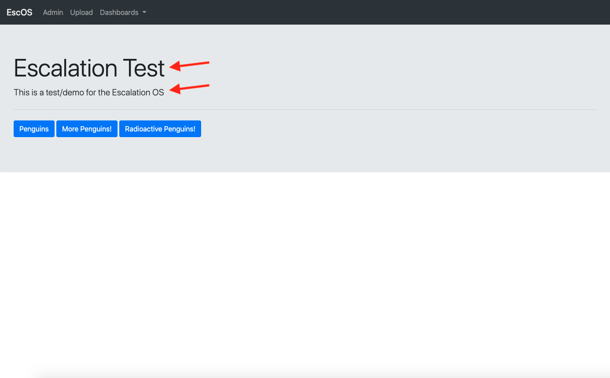
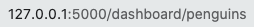
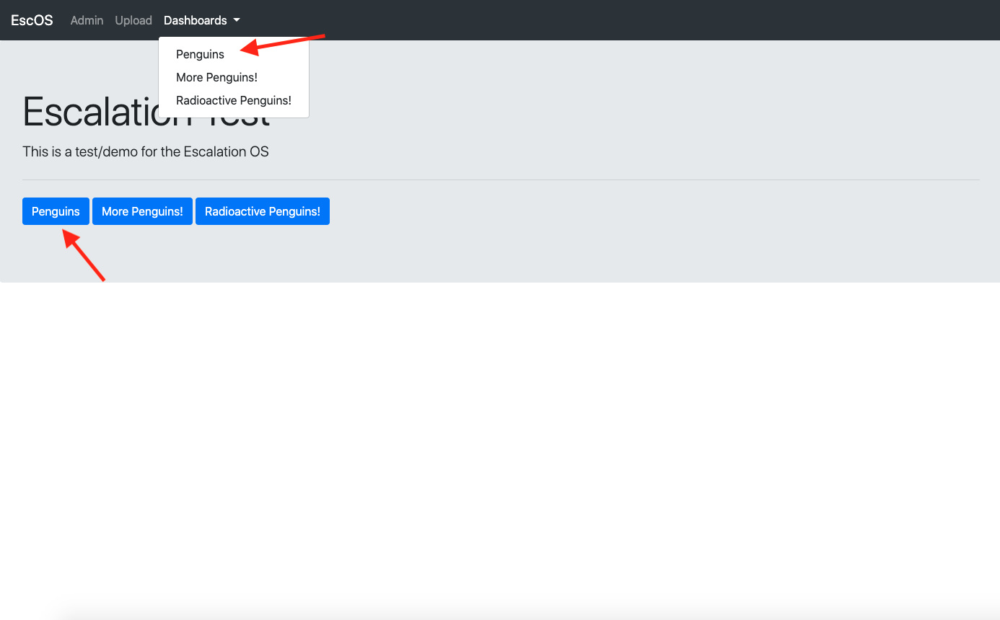
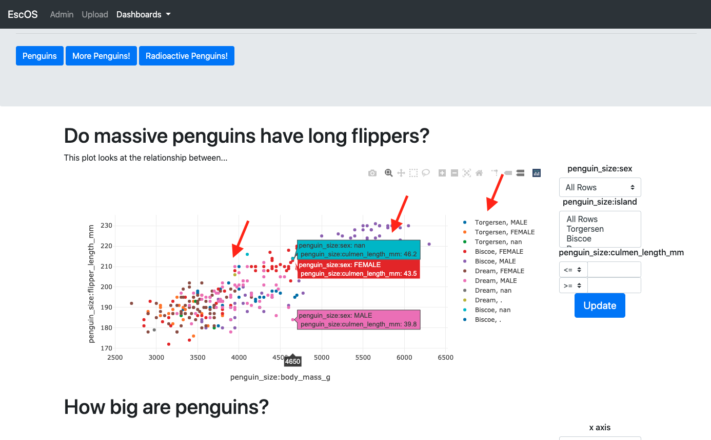
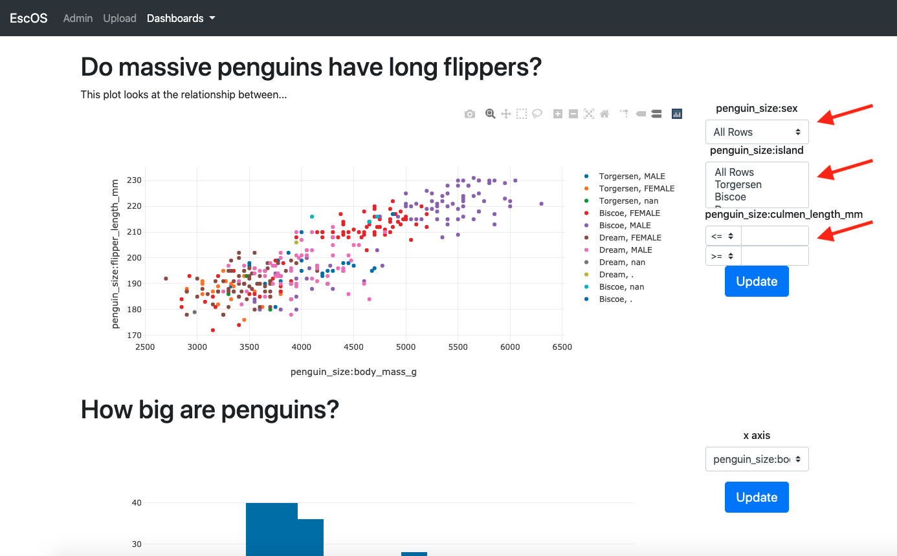
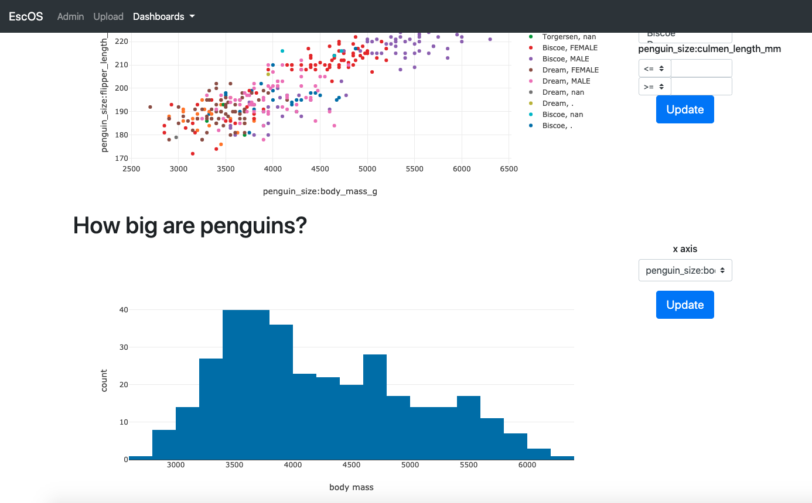
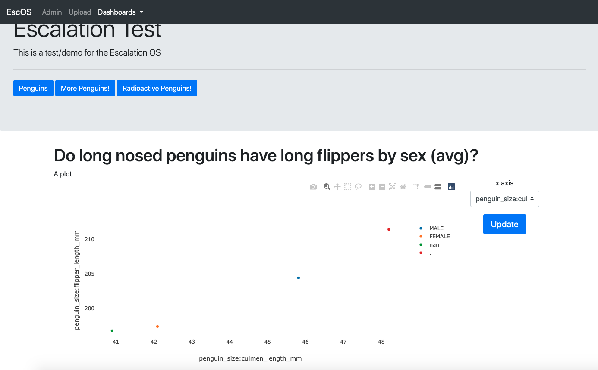

# Config example
This file walks through some of the lines in the [penguin_config](../../escalation/tests/test_data/test_app_local_handler_config.json)
  example.

##
"title": "Escalation Test"  
"brief_desc": "This is a test/demo for the Escalation OS"

##

"data_backend": "local_csv",  
"data_file_directory": "tests/test_data/",  
"data_sources": \[
    "penguin_size",
    "mean_penguin_stat",
    "penguin_size_small"
\],  

data_backend - should the website search for data in files (local_csv)
or in a data base
data_file_directory - path to files
data_sources - folders that the website uses in data_file_directory
##
"penguins": {  
This can be anything alpha numeric and underscores (without spaces). Determines the url

##
"button_label": "Penguins"

##
"graphic_0": {
This can be anything alpha numeric and underscores (without spaces). unique key for graphic
##
"data_sources": \[
                        {
                            "data_source_type": "penguin_size"
                        }
                    \],
which data your graphic will be using
##
"title": "Do massive penguins have long flippers?"  
"brief_desc": "This plot looks at the relationship between...",

##
"data": {
    "points_0": {
        "x": "penguin_size:body_mass_g",
        "y": "penguin_size:flipper_length_mm"
    }
},  

The columns corresponding to the x and y coordinates.
Note all columns are referenced by 
'<data_source_name>:<column_name>'  
##
"plot_specific_info": {
                        "data": \[
                            {
                                "type": "scatter",
                                "mode": "markers"
                            }
                        \]
                    },
"visualization_options": \[  
                        {
                            "type": "hover_data",
                            "column":\[
                                "penguin_size:sex",
                                "penguin_size:culmen_length_mm"
                            \]
                        },  
                        {
                            "type": "groupby",
                            "column": \[
                                "penguin_size:island",
                                "penguin_size:sex"
                            \],
                        }
                    \],
                    
                    

##
"selectable_data_list": \[  
                        {
                            "type": "select",
                            "column": "penguin_size:sex",
                            "options": {
                                "multiple": false
                            }
                        },  
                        {
                            "type": "select",
                            "column": "penguin_size:island",
                            "options": {
                                "multiple": true
                            }
                        },  
                        {
                            "type": "numerical_filter",
                            "column": "penguin_size:culmen_length_mm"
                        }
                   \ ]
                },

                
##
Now for reference here is graphic_1 on page penguins
 

and graphic_0 made on page more_penguins

