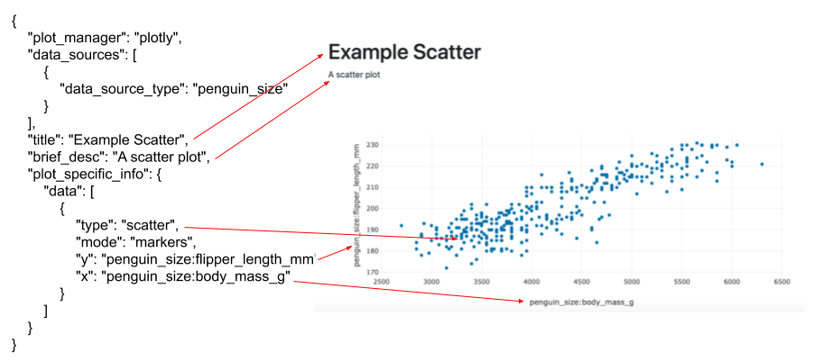
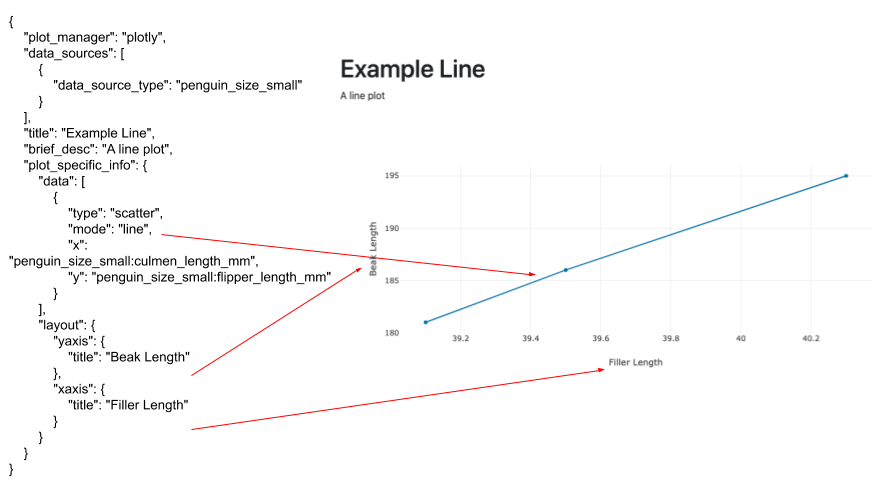
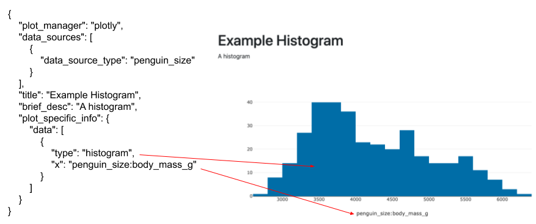
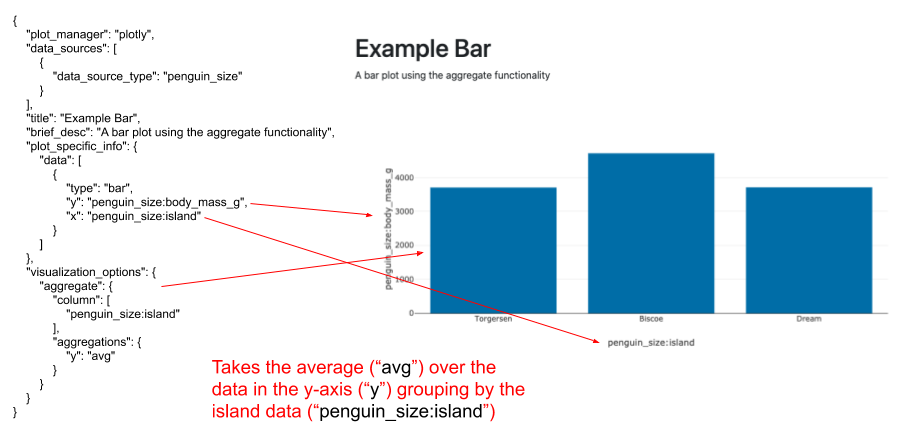

# Plotly Config Information

We have a lot of the Plotly graphing library built in to this application. This document explains how to edit the
config file in accordance with the Plotly schema. 
For a individual graphic (dictionaries in the "graphics" dictionary):
 - In the config json, plot_manager: plotly 
 - In "data", "data": {points_\<num>:{\<axis>:\<column_name>}}  
 \<num> corresponds which line on the plot the data corresponds to. This starts at 0.   
 \<axis>. e.g. "x","y"
 - "plot_specific_info" : this config matches the config as defined by the plotly 
 documentation at https://plotly.com/javascript/reference/ with exception axes like "x" and "y"
 do not need to be defined again.
 
## Examples
  First see [simple config](config_information/config_example/config_example.md) for a full example.  
  The rest of these examples will only show the "available_pages" dictionary

- A simple scatter plot

 - A line plot shows how to make custom labels for your axes
 
 - How to create hover text/tooltip for your data
 
 - How to create a simple histogram
 
 - A box plot using the groupby functionality
 
 - A bar chart using the aggregate functionality
 
 - A 3d scatter plot
 