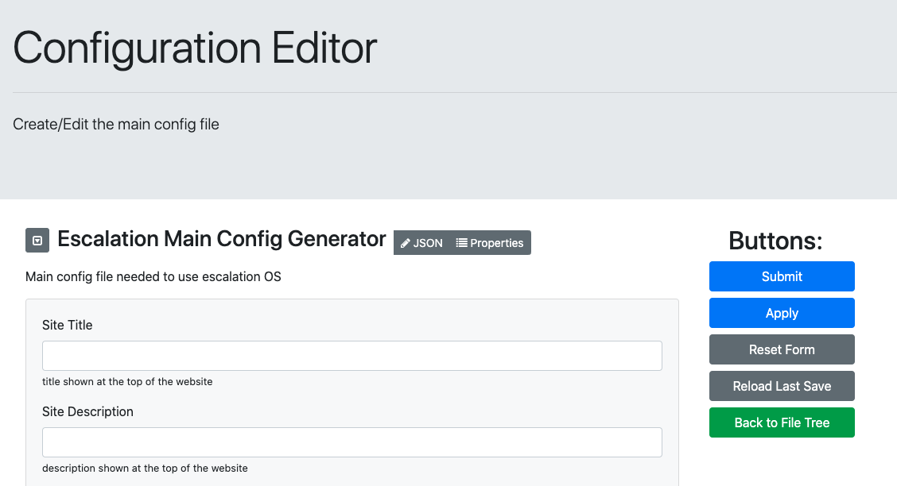
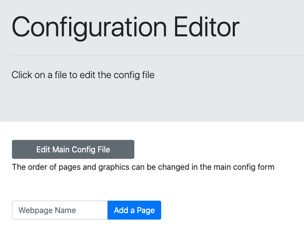
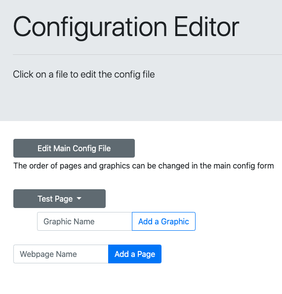
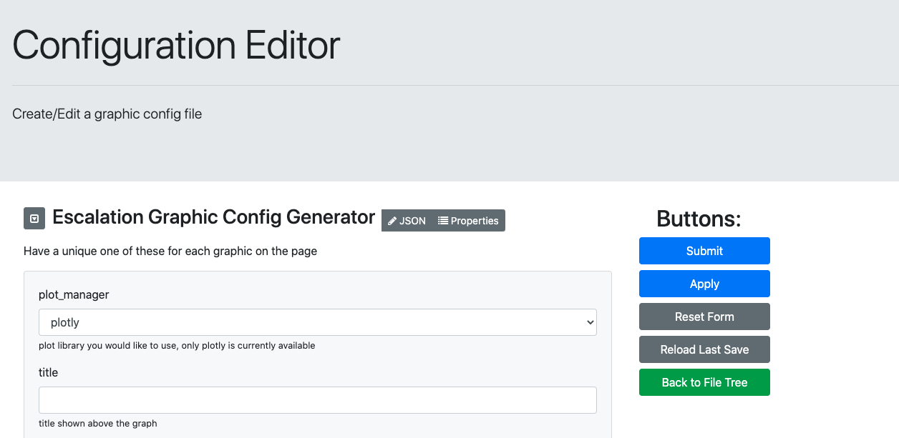
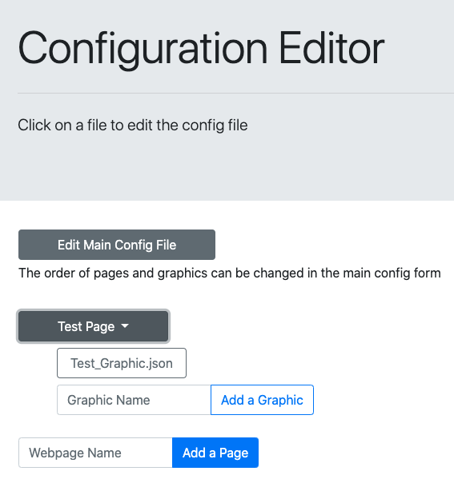

# Creating Your First Config Files with Wizard UI
This readme runs though creating the main config file and a graphic file using the wizard. Before starting this tutorial,
you should have set up your data (see [local data set up](../local_example/local_data_storage_config_info.md) or database set up)
and have your docker container set up.
Ready? Let's begin.

- First open the url where wizard app is being hosted. Once open you should see

 - Follow the directions to fill out the form. If you need additional instructions click [here](../main_config_example/main_config_example.md).
 - When the form is completed click the submit button. It will bring you to this page:

 - Now let us add a page. Type a name for your page and click the add a page button

- Click on your page to see which graphics are in the page.

- There currently are not any so let us add one. Type in a name and click add a graphic. You will be brought to the graphic 
config editor. Follow the directions to fill out the form. See
 [the gallery](../gallery/index.html) for ideas.

- Once you are done click submit. Now you will have a graphic in your page. 

