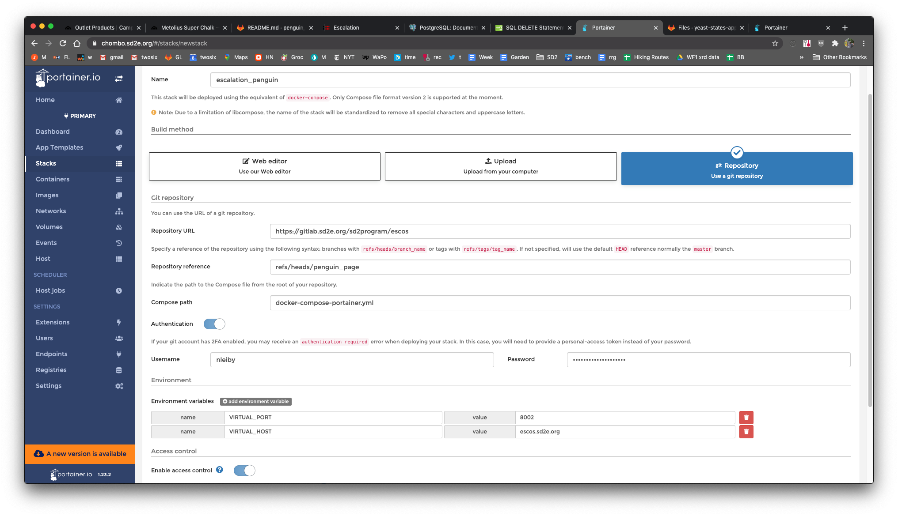

# Run demo app on portainer

# Moving local db to portainer:

1.Dump local db to file

    docker exec -i escos_db pg_dump --username escalation escalation > pg_dump.sql
    
2. scp dump to tacc

3. on portainer db container, run:

    apt update
    apt install -y openssh-client
    scp nleiby@login1.maverick2.tacc.utexas.edu:/work/05839/nleiby/maverick2/pg_dump.sql .
    psql -U escalation -d escalation -f pg_dump.sql